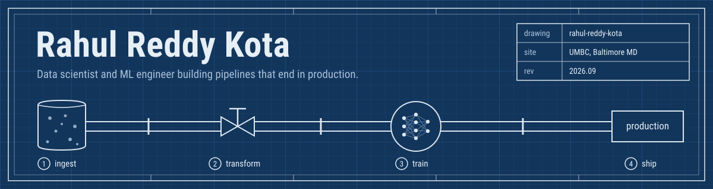
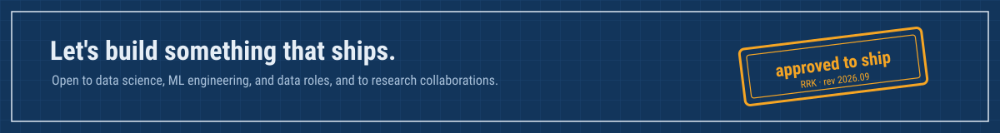

<p align="center">
  
</p>

<p align="center">
  <a href="https://www.linkedin.com/in/rahul-reddy-kota-b55a3a251/"></a>
  <a href="https://rahulreddykota.github.io/"></a>
  <!-- To add email, uncomment and replace the address:
  <a href="mailto:you@example.com"></a>
  -->
</p>

## Spec sheet

```yaml
# rahul-reddy-kota
role: Data scientist and ML engineer
location: Baltimore, MD

education:
  - M.S. Data Science, UMBC (Dec 2026)
  - B.Tech Computer Science, SNIST (2023)

experience:
  - where: UMBC Data Analytics Lab
    role: Research assistant (2025 to now)
    impact: 40% less manual preprocessing for faculty research
  - where: Accenture, Hyderabad
    role: Data analyst (2022 to 2024)
    built: Post-merger migration into a Databricks Lakehouse
    impact: 25% less manual effort through Tableau KPI dashboards

certified:
  - AWS Certified Cloud Practitioner
  - Microsoft Power BI Data Analyst Associate
  - Google Data Analytics Professional Certificate

learning_now: [LLM fine-tuning, distributed systems, cloud-native design]
open_to: [Data scientist, ML engineer, Data analyst, SWE, Solutions architect]
```


## Toolkit, by pipeline stage

| Stage | Tools |
| --- | --- |
| **① Ingest** | <br>Cosmos DB, Snowflake, Kafka |
| **② Transform** | <br>Apache Spark (PySpark), Hadoop, Hive, Azure Databricks, AWS EMR, Oracle Data Integrator |
| **③ Train** | <br>Keras, Hugging Face, FinBERT, ChromaDB, Ollama |
| **④ Ship** | <br>Azure DevOps, CI/CD, Power BI, Tableau, Jira |
| **Languages** | <br>SQL |


## Shipped projects

<table>
<tr>
<td width="50%" valign="top">

### [DermaFusion](https://github.com/RahulReddyKota/DermaFusion)
Classifies dermoscopic images from HAM10000 using ResNet50 and VGG16 transfer learning. Grad-CAM heatmaps show which part of each lesion drove the prediction.


<sub>TensorFlow · Keras · OpenCV · Grad-CAM</sub>

</td>
<td width="50%" valign="top">

### [ARC AI](https://github.com/RahulReddyKota/ARC-AI-Augmented-Reasoning-Core)
Answers Maryland tenant and landlord questions with citations back to official sources. Runs locally and switches between three open models in real time.


<sub>Python · ChromaDB · Ollama · sentence transformers</sub>

</td>
</tr>
<tr>
<td width="50%" valign="top">

### Job Market Analysis
Processes millions of raw job postings on AWS EMR, then surfaces skill demand, salary benchmarks, and regional hiring patterns in Power BI.


<sub>PySpark · Hive · AWS EMR · S3 · Power BI</sub>

</td>
<td width="50%" valign="top">

### Trading on Trends
Predicts next-day stock direction by combining FinBERT sentiment on headlines with RSI, MACD, and Bollinger Band signals.


<sub>Python · FinBERT · LSTM · SQL</sub>

</td>
</tr>
<tr>
<td width="50%" valign="top">

### Cyberbullying Detection
Sorts messages into six categories with a Bi-LSTM on GloVe embeddings, beating SVM and Naive Bayes baselines on macro F1.


<sub>TensorFlow · Keras · Bi-LSTM · GloVe</sub>

</td>
<td width="50%" valign="top">

### Your project here
Working on something in healthcare AI, RAG, or big data? I'm looking for the next pipeline to build.

[Message me on LinkedIn](https://www.linkedin.com/in/rahul-reddy-kota-b55a3a251/)

</td>
</tr>
</table>

<p align="center">
  
</p>
